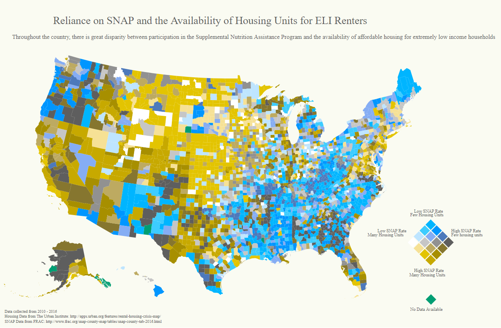

Created by: Andrew Vallaster, Omar Salemohamed, and Yasoob Rasheed

The purpose of this visualization is to examine the relationship between different measures of poverty within a geographic context. More specifically, we have taken both the participation rates of the federally funded Supplemental Nutrition Assistance Program (SNAP) as well as the number of housing units available to extremely low-income (ELI) renters as indicators of poverty and found data with regards to both variables at the county-level.  We map both the county-level SNAP participation rate, as well as the number of housing units available to ELI renters per 100 units within that county. As such, our visualization lends itself to questions such as: in which regions of the U.S. do people have access to affordable housing with little need of nutrition assistance? Additionally, we are trying to investigate if there is an underlying relationship between a county’s participation in the SNAP program, and the number of housing units it has available to ELI renters. Moreover, we want to see if such a relationship can be understood within a larger geographic context. For instance, are there notable trends between these two data points and the geographic identity (urban vs. rural) of a given county?  

## Setup

```sh
npm install
# then
npm run start

# or if yarn-ing
yarn
# then
yarn start
```

Open browser to localhost:9966

